 

  

 

## About

I am a Class XII (PCM) student from Shrimadhopur, a small town in Sikar district, Rajasthan, self-taught in Python, and working at the intersection of **Bayesian reasoning, reinforcement learning, and cognitive computing**.

I learn by building. Every project below started as a real question I didn't have an answer to yet.

 

## Flagship: ARPIK.AI

<table width="100%">
<tr>
<td width="24%" align="center" valign="middle">

</td>
<td width="76%" valign="top">

**ARPIK.AI, "Your Secret Friend"** (version 0.1)

A free reflection and decision-support companion for students. It does not tell you what to do. It helps you understand yourself well enough to decide.

- **Reflect:** guides a regret through Reason, Pattern, Lesson and Next step
- **Talk:** multilingual AI chat, with voice input in 12 languages
- **Radar:** matches real opportunities, linking only to official sources
- **Decide:** maps trade-offs, uncertainties and questions without choosing for you
- **Growth:** shows patterns over time from reflections stored on the user's own device

Free to use, with an optional on-device private mode and no chat storage on any server. A crisis safeguard points to Tele-MANAS 14416. It is a reflection tool, not a therapist.

[Open ARPIK.AI](https://arpitprk89.github.io/arpik-ai/)

</td>
</tr>
</table>

 

## Journey

 

## Academic record

| Class | Result | Board / School |
|:---:|:---:|:---|
| IX | **82.25%**, First Division | Blue Bell Universal Academy |
| X | **84.67%**, First Division | RBSE Board Examination |
| XI | **88.40%**, First Division | Prince High School, Sikar |
| XII | *In progress* | Sai Gurukul Academy |

India does not use a single GPA scale. The results above are official RBSE percentages, the primary record.

 

## Selected work

| Project | What it explores |
|:---|:---|
| **[Brain 2.0](https://arpitprk89.github.io/Brain-2.0/)** | A Bayesian model of student cognitive load, tracking sleep, study hours and stress, and updating its estimate as new information comes in. Weights are hand-picked; stated openly as a learning project, not a clinical tool. |
| **[Vidya Yatra](https://arpitprk89.github.io/-Vidya-Yatra/)** | Maps the academic journey from Class 1 to 12: subject choices, social pressure, and how competitive exams shape decisions students make about their future. |
| **[33 Koti](https://arpitprk89.github.io/33-KOTI/)** | Reads the 33 deva categories of Vedic tradition through the lens of modern psychology: human behaviour, inner traits and recurring patterns, in a digital form. |
| **[Bayesian Decision Maker](https://github.com/arpitprk89/bayesian-decision-maker)** | Bayesian inference for decision-making under uncertainty. Inspired by the work of Prof. Kenji Doya, OIST. |
| **[RL Visualiser](https://arpitprk89.github.io/rl-visuliser/)** | An interactive Q-learning grid: watch an agent learn to reach a goal through experience and feedback, mistake by mistake. |
| **[Cognitive AI Simulator](https://github.com/arpitprk89/cognitive-ai-simulator)** | A small model of how a student's emotional and cognitive state shifts across a sequence of decisions: mood, stress, focus and a running memory log. |
| **[AI Quiz Game](https://github.com/arpitprk89/ai-quiz-game)** | A ten-question interactive quiz on core AI and machine learning concepts, with instant explanations after every answer. |
| **[Student Study Helper](https://github.com/arpitprk89/student-study-helper)** | A grade tracker with simple data analysis, built to help students see their own patterns and stay motivated. |

 

## Press

**Shekhawati Live**, *"श्रीमाधोपुर के 16 वर्षीय अर्पित ने बनाए 5 AI प्रोजेक्ट"*, September 29, 2026. [Read the article](https://shekhawatilive.com/sikar/shrimadhopur-16-year-old-arpit-parik-ai-projects.html/)

 

## Certifications

[HackerRank Certificate 01](https://www.hackerrank.com/certificates/263871542b77) · [HackerRank Certificate 02](https://www.hackerrank.com/certificates/e036c3a56d67) · [HackerRank Certificate 03](https://www.hackerrank.com/certificates/457324ab2b0a)

 

## Technical interests

Python · Git · GitHub · HTML5 · CSS3 · JavaScript

Artificial Intelligence · Machine Learning · Reinforcement Learning · Bayesian Inference · Decision Systems · Cognitive Computing

 

## Beyond code

I am interested in AI, physics, mathematics, storytelling, and building technology that opens doors for students from places where resources are limited. Through **ARPIK.AI** and **AZ Group**, I want to help students from small towns and rural India move further into AI, coding and research, and get their work seen beyond where they started.

 

*Build. Learn. Experiment. Repeat.*

